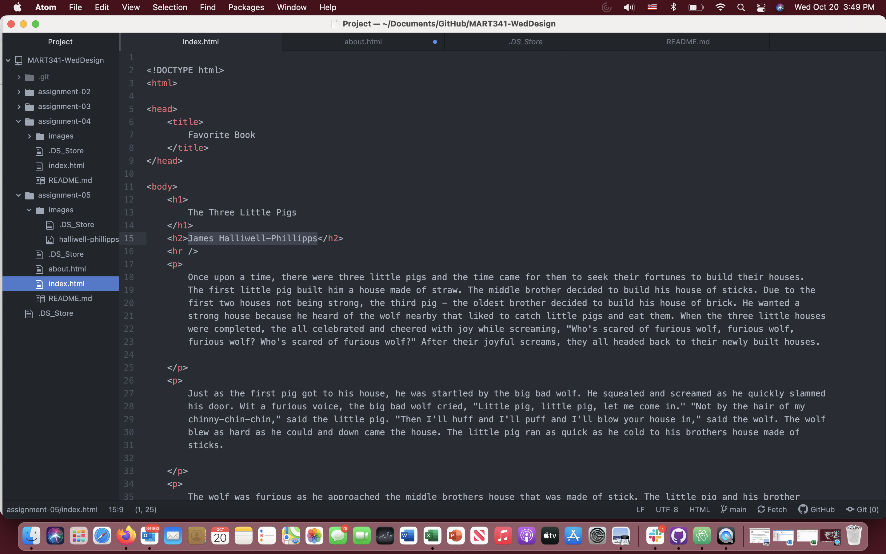

When visiting a site using The Wayback Machine, I clicked on amazon.com in the archives from February 04, 2005. It looks really different from the current Amazon website and Amazon app that I currently use to purchase lots of items. The appearance has changed dramatically. The current website has images that you can click on to obtain more information about the item selected, however, the older archived version has more hyperlinks that you need to click on.
The topics aren't that difficult to understand. The issues I'm finding is with Atom and GitHub Desktop. I'm not understanding the functionality and how to make these two programs communicate properly. I have an appointment with my professor tomorrow to discuss these issues.

